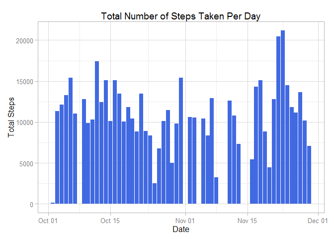
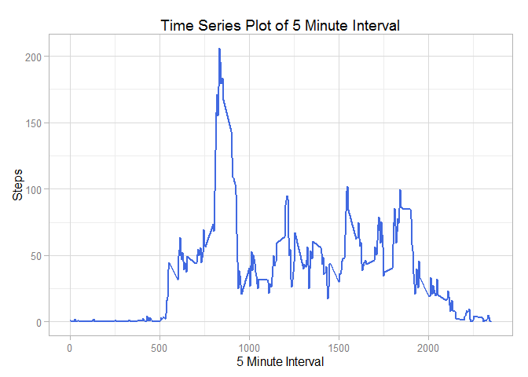
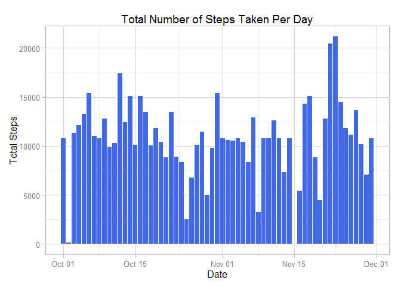
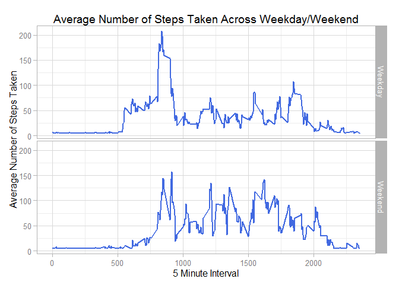

COURSERA
--------

REPRODUCIBLE RESEARCH
---------------------

#### Week 2: Assignment 1

#### Load library

    library(ggplot2)

#### Loading data

Load data using the **read.csv()** and store it into an object called
**activity**. *It is assumed that the dataset has been downloaded and
saved in the current working directory*.

    activity <- read.csv("C:\\Users\\Sahil\\OneDrive\\Documents\\Coursera\\Data Science Specialization_John Hopkins\\05_Reproducible Research\\Week 2\\activity.csv")

#### Data Exploration and Data Preprocessing

Check the structure, number of rows/columns and display the first 3
rows.

    str(activity)

    ## 'data.frame':    17568 obs. of  3 variables:
    ##  $ steps   : int  NA NA NA NA NA NA NA NA NA NA ...
    ##  $ date    : Factor w/ 61 levels "2012-10-01","2012-10-02",..: 1 1 1 1 1 1 1 1 1 1 ...
    ##  $ interval: int  0 5 10 15 20 25 30 35 40 45 ...

    head(activity,3)

    ##   steps       date interval
    ## 1    NA 2012-10-01        0
    ## 2    NA 2012-10-01        5
    ## 3    NA 2012-10-01       10

There are 3 variables with 17568 observations.

We convert **date** variable to *date class* from *factor class* for our
analysis.

    activity$date <- as.Date(activity$date)

Check if there are any missing values.

    colSums(is.na(activity))

    ##    steps     date interval 
    ##     2304        0        0

There are 2304 missing values in the dataset.

### Question 1: What is the mean total number of steps taken per day?

For the first question; we will not treat the missing values. Calculate
the total steps taken per day and store it in a new data frame called
**totalSteps**.

    totalSteps <- aggregate(steps~date,activity,sum)

Let us check the **totalSteps** data frame.

    head(totalSteps)

    ##         date steps
    ## 1 2012-10-02   126
    ## 2 2012-10-03 11352
    ## 3 2012-10-04 12116
    ## 4 2012-10-05 13294
    ## 5 2012-10-06 15420
    ## 6 2012-10-07 11015

Create histogram to display the total steps taken per day

    plot1 <- ggplot(totalSteps, aes(date,steps)) + geom_bar(stat="identity",fill="royal blue") + xlab("Date") + ylab("Total Steps") + ggtitle("Total Number of Steps Taken Per Day") + theme(plot.title=element_text(size=14, face="bold"),axis.text=element_text(size=14), axis.title=element_text(size=14,face="bold")) + theme_light()

Display the histogram

    plot1

Calculate the mean and median for total number of steps taken per day

-   Mean

<!-- -->

    mean(totalSteps$steps)

    ## [1] 10766.19

-   Median

<!-- -->

    median(totalSteps$steps)

    ## [1] 10765

### Question 2: What is the average daily activity pattern?

Calculate the average number of steps taken by intervals of 5-minute
intervals and store it in a new data frame called **timeSeries**.

    timeSeries <- aggregate(steps~interval,activity,mean)

Let us check the **timeSeries** data frame

    head(timeSeries)

    ##   interval     steps
    ## 1        0 1.7169811
    ## 2        5 0.3396226
    ## 3       10 0.1320755
    ## 4       15 0.1509434
    ## 5       20 0.0754717
    ## 6       25 2.0943396

Generate plot to display the average number of steps taken by 5 minute
intervals

    plot2 <- ggplot(timeSeries,aes(interval,steps)) + geom_line(color="royal blue",size=1) + xlab("5 Minute Interval") + ylab("Steps") + ggtitle("Time Series Plot of 5 Minute Interval") + theme(plot.title=element_text(size=14, face="bold"),axis.text=element_text(size=14), axis.title=element_text(size=14,face="bold")) + theme_light()

Display plot.

    plot2

Calculate which 5 minute interval on average across all days has the
maximum number of steps

    maxInterval <- timeSeries[timeSeries$steps == max(timeSeries$steps),]
    maxInterval

    ##     interval    steps
    ## 104      835 206.1698

The 5 minute interval on average across all days that has the maximum
number of steps is 835.

### Question 3: Impute missing values

1.  Calculate the number of missing values in the dataset.

<!-- -->

    colSums(is.na(activity))

    ##    steps     date interval 
    ##     2304        0        0

The total number of missing values are 2304. They are coded as *NA*.

1.  Devise a strategy to replace the missing values in the dataset. We
    will replace the missing values by the mean.

2.  Create a new dataset that is equal to the original dataset with
    missing data filled in.

The new dataset is called **newActivity**.

    newActivity <- activity

Replace the missing values with the mean.

    newActivity$steps[is.na(newActivity$steps)] <- mean(newActivity$steps,na.rm=TRUE)

Check the first 6 rows of **newActivity**.

    head(newActivity)

    ##     steps       date interval
    ## 1 37.3826 2012-10-01        0
    ## 2 37.3826 2012-10-01        5
    ## 3 37.3826 2012-10-01       10
    ## 4 37.3826 2012-10-01       15
    ## 5 37.3826 2012-10-01       20
    ## 6 37.3826 2012-10-01       25

Missing values have been replaced by the mean.

1.  Generate a histogram of the total number of steps taken per day
    Calculate the total steps taken per day and store it in a new data
    frame called **totalStepsImpute**.

<!-- -->

    totalStepsImpute <- aggregate(steps~date,newActivity,sum)

Let us check the **totalStepsImpute** data frame

    head(totalStepsImpute)

    ##         date    steps
    ## 1 2012-10-01 10766.19
    ## 2 2012-10-02   126.00
    ## 3 2012-10-03 11352.00
    ## 4 2012-10-04 12116.00
    ## 5 2012-10-05 13294.00
    ## 6 2012-10-06 15420.00

Generate histogram

    plot3 <- ggplot(totalStepsImpute, aes(date,steps)) + geom_bar(stat="identity",fill="royal blue") + xlab("Date") + ylab("Total Steps") + ggtitle("Total Number of Steps Taken Per Day") + theme(plot.title=element_text(size=14, face="bold"),axis.text=element_text(size=14), axis.title=element_text(size=14,face="bold")) + theme_light()

Display histogram:

    plot3

Calculate the mean and median for total number of steps taken per day

-   Mean

<!-- -->

    mean(totalStepsImpute$steps)

    ## [1] 10766.19

-   Median

<!-- -->

    median(totalStepsImpute$steps)

    ## [1] 10766.19

**Observations**

-   Do these values differ from the estimates from the first part of the
    assignment?

<table>
<thead>
<tr class="header">
<th align="left">Measure</th>
<th align="left">With Missing Values</th>
<th align="left">Without Missing Values</th>
</tr>
</thead>
<tbody>
<tr class="odd">
<td align="left">mean</td>
<td align="left">10766.19</td>
<td align="left">10766.19</td>
</tr>
<tr class="even">
<td align="left">median</td>
<td align="left">10765</td>
<td align="left">10766.19</td>
</tr>
</tbody>
</table>

Mean values do not differ but the median value has a slight difference.

-   What is the impact of the missing data on the estimates of the total
    daily number of steps?

Comparing *plot1* and *plot2*; the shape of the histogram remains same.
Impact of imputing missing data on the estimates is low.

### Question 4: Are there any differences in activity patterns between weekdays and weekends?

1.  Create a new factor variable in the dataset with two levels -
    "weekday" and "weekend" indicating whether a given date is a weekday
    or weekend day.

Create a new variable called **day**. It displays whether the day from
the date is a *weekend* or a *weekday*.

    newActivity$day <- as.factor(ifelse(weekdays(newActivity$date) %in% c("Saturday","Sunday"),"Weekend","Weekday"))

Check the first 6 rows of **newActivity**

    head(newActivity)

    ##     steps       date interval     day
    ## 1 37.3826 2012-10-01        0 Weekday
    ## 2 37.3826 2012-10-01        5 Weekday
    ## 3 37.3826 2012-10-01       10 Weekday
    ## 4 37.3826 2012-10-01       15 Weekday
    ## 5 37.3826 2012-10-01       20 Weekday
    ## 6 37.3826 2012-10-01       25 Weekday

1.  Make a panel plot containing a time series plot (i.e. type = "l") of
    the 5-minute interval (x-axis) and the average number of steps
    taken, averaged across all weekday days or weekend days (y-axis).
    Calculate the average number of steps taken across all *day* type
    variable

<!-- -->

    timeSeriesDay <- aggregate(steps~interval+day,newActivity,mean)

Display the **timeSeriesDay** data frame

    head(timeSeriesDay)

    ##   interval     day    steps
    ## 1        0 Weekday 7.006569
    ## 2        5 Weekday 5.384347
    ## 3       10 Weekday 5.139902
    ## 4       15 Weekday 5.162124
    ## 5       20 Weekday 5.073235
    ## 6       25 Weekday 6.295458

Generate time series plot.

    plot4 <- ggplot(timeSeriesDay,aes(interval,steps)) + geom_line(color="royal blue",size=1) + facet_grid(day~.) + xlab("5 Minute Interval") + ylab("Average Number of Steps Taken") + ggtitle("Average Number of Steps Taken Across Weekday/Weekend") + theme(plot.title=element_text(size=14, face="bold"),axis.text=element_text(size=14), axis.title=element_text(size=14,face="bold")) + theme_light()

Display plot.

    plot4

**Observations**

-   Are there any differences in activity patterns between weekdays and
    weekends?

Plot4 depicts differences in activity patterns between weekdays and
weekends. Weekday has the highest peak but weekend has more peaks
compared to weekdays. Activity seems more during the weekends.
